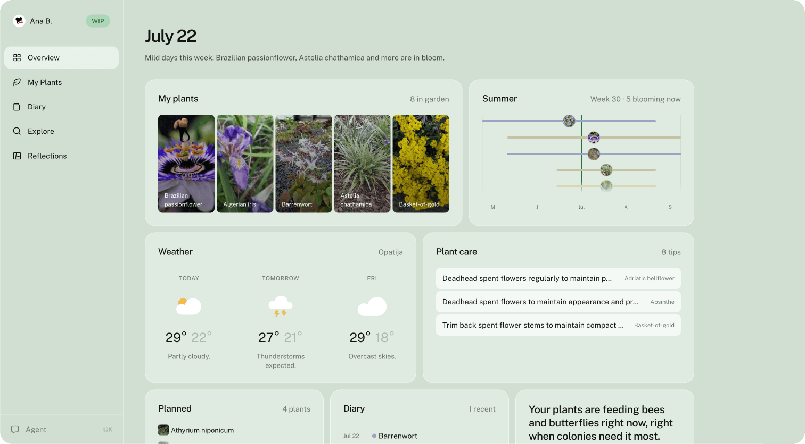
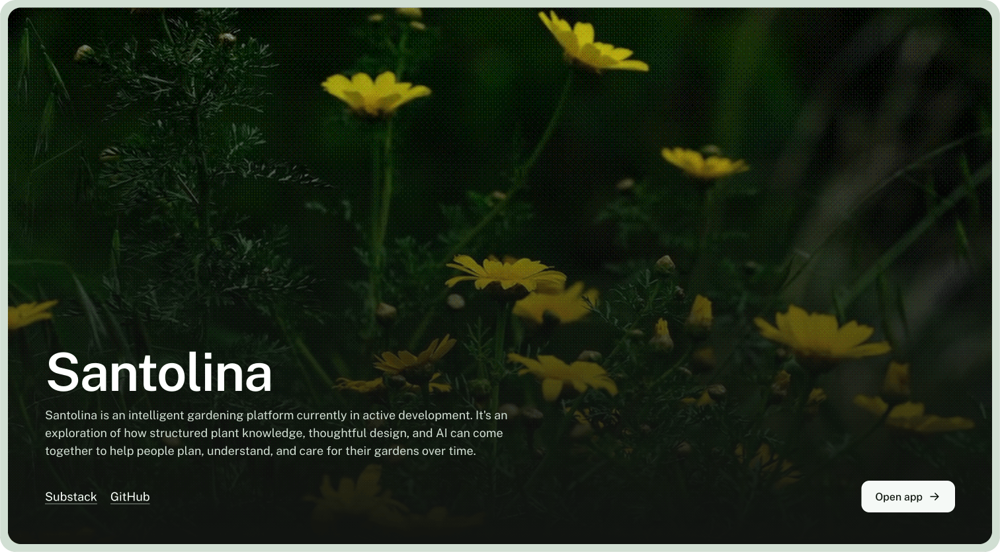

# Santolina

An AI-native garden planning platform that combines horticultural knowledge, structured plant data, and intelligent recommendations to help people design and manage beautiful outdoor spaces. Built as a monorepo alongside Paradox UI, a design system extracted from the product as it's built, headed for a separate MIT license once it's ready for external use.



[santolina.app](https://santolina.app) · [Paradox UI Storybook](https://paradoxich.github.io/paradoxui) · [Build log](https://paradoxich.substack.com)

## Overview

Santolina helps beginner to intermediate gardeners design and manage ornamental gardens. Users describe their conditions and style preferences and get a curated plant palette with seasonal guidance.

The app runs entirely on Supabase: magic-link and Google auth, row-level security on every user-owned table, and private photo storage behind signed URLs.



The monorepo contains the Next.js web app and the Paradox UI packages (@paradoxui/ui, @paradoxui/tokens), kept deliberately separate so the design system stays extractable.

## Monorepo Structure

```
santolina/
├── apps/
│   └── web/                  # Next.js plant app (santolina-web)
├── packages/
│   ├── tokens/               # @paradoxui/tokens — pure CSS design tokens
│   ├── ui/                   # @paradoxui/ui — React component library
│   ├── typescript-config/    # @paradoxui/typescript-config — shared TS configs
│   └── eslint-config/        # @paradoxui/eslint-config — shared ESLint configs
├── turbo.json                # Turborepo pipeline config
├── pnpm-workspace.yaml       # pnpm workspace config
└── package.json              # Root package.json
```

## Tech Stack

- **Package manager**: pnpm with workspaces
- **Monorepo orchestration**: Turborepo
- **Node version**: 20 LTS
- **App**: Next.js 15, TypeScript, Tailwind CSS, Framer Motion, Supabase
- **Plant data pipeline**: Trefle API + Anthropic API (Claude) — offline curation and cross-check scripts, see below
- **UI library**: React 19, TypeScript, Tailwind CSS, Storybook 8
- **Tokens**: Pure CSS custom properties

## Setup

### Prerequisites

- Node.js 20 LTS (`nvm use`)
- pnpm 9 (`npm install -g pnpm@9`)

### Install

```bash
# Install all dependencies
pnpm install

# Copy environment variables (only if .env.local doesn't exist yet)
cp -n apps/web/.env.example apps/web/.env.local
# Fill in your values in .env.local
#
# Warning: `cp` without -n overwrites an existing .env.local and wipes your keys.
# To back up first: cp apps/web/.env.local apps/web/.env.local.bak
```

### Development

```bash
# Run everything in dev mode (Next.js + Storybook)
pnpm dev

# Run only the web app
pnpm --filter santolina-web dev

# Run only Storybook
pnpm --filter @paradoxui/ui storybook
```

### Build

```bash
pnpm build
```

### Lint & Format

```bash
pnpm lint
pnpm format
```

### Type Check

```bash
pnpm typecheck
```

### Test

```bash
pnpm test
```

### Plant data layer

The `plants` table is seeded from Trefle, then enriched and extended by a series
of AI passes. All scripts live in `apps/web/scripts/` and require the relevant
keys in `apps/web/.env.local` (`TREFLE_API_KEY`, `ANTHROPIC_API_KEY`):

```bash
cd apps/web

# 0. Back up the two mutable tables first (JSON under backups/; restore-catalog.ts to undo)
./node_modules/.bin/tsx --env-file=.env.local scripts/backup-catalog.ts

# 1. Seed botanical facts from Trefle (skips already-cataloged species).
#    --round is REQUIRED: it records the batch in rounds/<label>/manifest.json,
#    which is what every step below scopes by.
./node_modules/.bin/tsx --env-file=.env.local scripts/seed-plants.ts --round <label>

# 2. AI curation pass — fills gaps Trefle can't (care, style tags, seasonal rhythm)
./node_modules/.bin/tsx --env-file=.env.local scripts/curate-plants.ts --round <label> --new-only

# 3. Companion pairings — populates plant_combinations (idempotent; --limit N, --dry-run).
#    The scope picks who gets paired; the candidate roster stays the whole catalog.
./node_modules/.bin/tsx --env-file=.env.local scripts/curate-combinations.ts --round <label>

# 4. Regenerate native_region — MUST run after every seed, or new plants
#    silently drop out of the "native to my region" filter (review, then --apply)
./node_modules/.bin/tsx --env-file=.env.local scripts/regenerate-native-region.ts --round <label>

# 5. Guards — flag only, never edit data. Scope by --round, not --new-only:
#    --new-only is state-based and only narrows once every other row is stamped.
./node_modules/.bin/tsx --env-file=.env.local scripts/cross-check-plants.ts --round <label>
./node_modules/.bin/tsx --env-file=.env.local scripts/cross-check-native-to.ts --round <label>
./node_modules/.bin/tsx --env-file=.env.local scripts/check-bloom-colors.ts

# 5b. Validate native_region against Kew's WCVP, read through GBIF
./node_modules/.bin/tsx --env-file=.env.local scripts/cross-check-native-region.ts --round <label>

# 6. Draft RHS hardiness ratings for unrated rows in this round
./node_modules/.bin/tsx --env-file=.env.local scripts/draft-hardiness.ts --round <label>

# 7. Verify the catalog satisfies the round invariants (read-only; exits 1 on any FAIL)
./node_modules/.bin/tsx --env-file=.env.local scripts/verify-round.ts

#    Then snapshot this round's guard reports into the committed rounds/<label>/ folder
./node_modules/.bin/tsx --env-file=.env.local scripts/archive-round.ts --round <label>
```

Run them in this order — the authoritative runbook, with the rationale for
each step, is [the round runbook](docs/architecture.md#round-runbook). Individual decisions: provider
choice and safe upsert ([the Trefle-over-Perenual choice](docs/architecture.md#plant-data-provider), [the safe Trefle upsert](docs/architecture.md#safe-upsert)), curation ([the curation model](docs/architecture.md#curation-model)), combinations ([plant combinations](docs/architecture.md#plant-combinations)),
cross-check ([the botanical cross-check](docs/architecture.md#botanical-cross-check)), native_region ([native_region](docs/architecture.md#native-region)), hardiness ([hardiness](docs/architecture.md#hardiness)), seasonal care ([seasonal_care](docs/architecture.md#seasonal-care)).
Guard reports land in `apps/web/reports/` (gitignored) and are archived per
round under `apps/web/rounds/<label>/` (committed); backups under
`apps/web/backups/` (gitignored).

## Further reading

- [`docs/architecture.md`](docs/architecture.md) — data-layer architecture decisions
- [`DESIGN_SYSTEM.md`](DESIGN_SYSTEM.md) — how to build UI in this repo (tokens, components, styling patterns)

## License

All rights reserved — see [`LICENSE`](LICENSE). See [`LICENSE_NOTES.md`](LICENSE_NOTES.md) for how this applies across the monorepo's two products.
